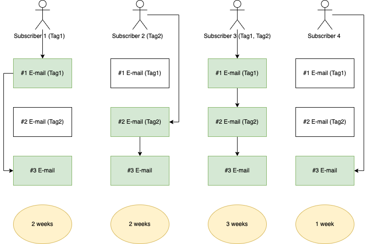
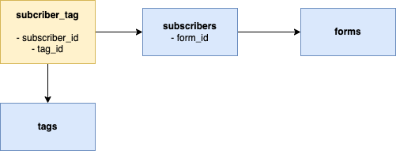
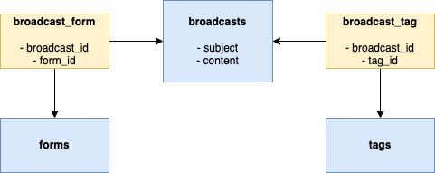
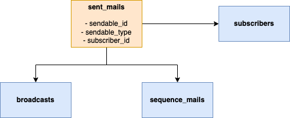
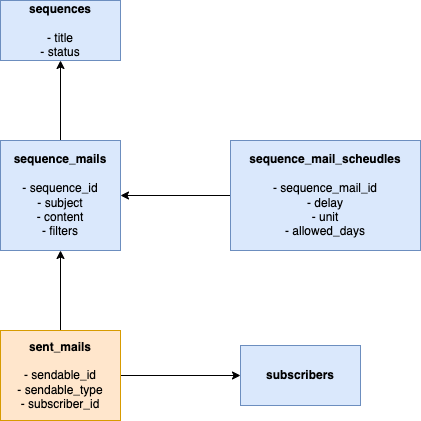
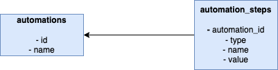
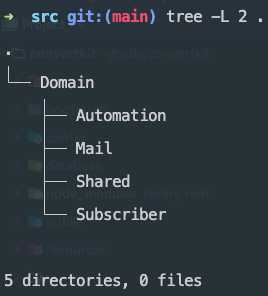
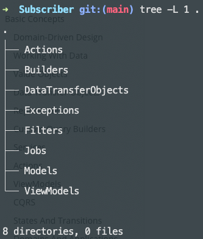
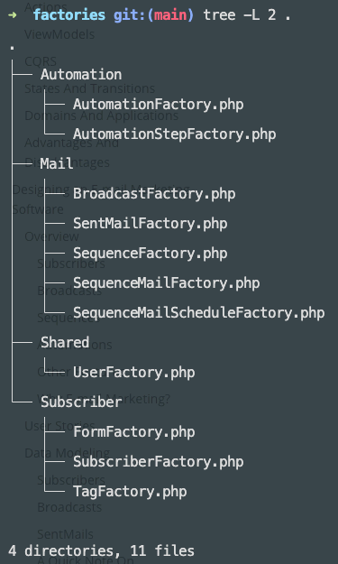

<style>
img {
    display: block;
    margin: auto;
}
</style>

# Diseño de un software de marketing por correo electrónico

La mayoría de los artículos o tutoriales de DDD le brindan algunas ideas abstractas y conceptos demasiado complicados y luego asumen que está listo para comenzar. Quiero hacer algo diferente así que la mejor manera de aprender nuevas ideas es construir proyectos. Entonces, en los próximos capítulos, construiremos un sistema de marketing por correo electrónico complejo y funcional, como [ConvertKit](https://convertkit.com/) o [MailChimp](https://mailchimp.com/). Si no estás familiarizado con estas aplicaciones, no entres en pánico, ya que explicaré cada característica importante.

## Descripción general

En esencia, una aplicación de marketing por correo electrónico es un software que almacena a sus suscriptores y usted puede enviarles correos electrónicos. Pero también viene con un gran conjunto de características más complejas, como:

- Gestión de `suscriptores`.
- Etiquetarlos. Las `etiquetas` son útiles para filtrar suscriptores cuando desea enviar correos electrónicos.
- `Envío de correos electrónicos` por transmisión (broadcast) o de una vez (One-Time). Usted escribe el contenido, configura los filtros y presiona el botón Enviar.
- Crear `secuencias`. Una secuencia es una colección de correos electrónicos entregados a los suscriptores después de un cierto retraso. Por ejemplo, escribe cuatro correos electrónicos y desea enviarlos en cuatro semanas. Puedes crear una secuencia que haga precisamente eso automáticamente. Y lo mejor de las secuencias es que también manejan nuevos suscriptores. Entonces, si crea esta secuencia en febrero y una persona se suscribe en mayo, aun así se la agregará y recibirá un correo electrónico por semana.
- `Agregar suscriptores a una secuencia` según criterios específicos. También podemos crear diferentes filtros. Por ejemplo, queremos excluir a los suscriptores que compraron un producto en particular o que tienen una etiqueta específica.
- `Crear formularios de suscripción` donde las personas puedan ingresar sus direcciones de correo electrónico. Puede crear un formulario HTML con una entrada de correo electrónico que se puede incrustar en su sitio. Si alguien envía este formulario, se agregará a su lista de correo electrónico.
- `Seguimiento` de aperturas de correos electrónicos (Tracking e-mail opens) y clics en enlaces.
- `Generar reportes` a partir de estas métricas.
- Y mucho más, pero estas son las características principales.

## Suscriptores

Los suscriptores representan a las personas de una lista de correo electrónico. Normalmente, un suscriptor tiene una dirección de correo electrónico y otros campos personalizados, como nombre, apellidos, etc. Un suscriptor puede añadirse a una lista de varias formas distintas:

- Manualmente
- Enviando un formulario de suscripción
- Mediante importación CSV

Los suscriptores también pueden tener etiquetas. Las etiquetas pueden utilizarse para filtrar personas de un determinado correo electrónico. Digamos que tiene una lista de correo electrónico que contiene personas que no han abierto sus correos electrónicos en los últimos seis meses. Primero, los consultas y los marcas con una etiqueta de inactivo. Más tarde, puedes escribir un correo electrónico en el que intentes retomar el contacto con estas personas. Cuando envíe este correo electrónico, querrá aplicar un filtro con la etiqueta `inactivo`, para que solo lo reciban esos suscriptores.

## Transmisiones (Broadcasts)

Las transmisiones (broadcast) son mensajes de correo electrónico que desea enviar una sola vez a un conjunto determinado de suscriptores. Primero, escribe el contenido y guárdalo; Después, puede enviarlo manualmente o programarlo para más tarde.
De cualquier forma, usted define qué suscriptores recibirán el correo. Puede filtrarlos por:

- ¿Qué etiquetas tienen?
- ¿De qué forma proceden?
- ¿Qué productos compraron?

No implementaremos productos y compras en la aplicación de ejemplo, por lo que nuestros filtros funcionarán basados en `etiquetas y formularios`.

Este tipo de métricas permiten realizar un seguimiento del rendimiento de una transmisión (broadcast) enviada:

- ¿Cuántas personas recibieron el correo?.
- Tasa de apertura. ¿Cuántas personas abrieron el correo?.
- Tasa de clics. Cuántas personas hicieron clic en un enlace dentro del contenido (si hay un enlace).

Estas tasas pueden expresarse, por ejemplo, en valores porcentuales:

- 1000 correos enviados
- 49% tasa de correos abiertos (se abrieron 490)
- 8% tasa de clics

## Secuencias

Imagínese que desea crear un curso por correo electrónico sobre `diseño basado en dominios`. Escribe ocho correos electrónicos con ocho conceptos e ideas diferentes. Si utiliza una transmisión (broadcast) para ello, obtendrá los siguientes resultados:

- El 1 de junio tienes 1000 suscriptores y envías el primer correo.
- Del 1 al 8 de julio, obtendrás 100 nuevos suscriptores. No han recibido el primer correo porque se unieron a su newsletter unos días después.
- El 8 de julio tienes 1100 suscriptores y envías el segundo correo.

Los 100 nuevos suscriptores nunca recibieron el primer correo electrónico. Comenzaron su curso en el segundo correo electrónico. Obviamente, esto no es lo que queremos. La primera parte de la solución es crear una secuencia. La segunda parte se discutirá luego.

Una secuencia es un conjunto de correos electrónicos agrupados. Usando el `curso de correo electrónico DDD` como ejemplo, puede crear una secuencia como esta:

- Nombre de la secuencia: `Curso de diseño basado en dominios`.

  - Primero correo electrónico: ¿Qué es DDD?
  - Segundo correo electrónico: ¿Uso de DTO?
  - Tercero correo electrónico: Los beneficios de los `objetos de valor`.

Queremos enviar un correo electrónico por semana pero solo los miércoles. Así podemos especificar retrasos entre cada correo electrónico:

- El primer correo electrónico se enviará el primer miércoles después de publicar la secuencia.
- El segundo correo electrónico se enviará el segundo miércoles.
- El tercer correo electrónico se enviará el tercer miércoles.

Podemos implementar esta lógica usando un comando de consola programado, incluso permitirte crear automatización donde puedes vincular múltiples secuencias usando condicionales.

Cada correo electrónico de la secuencia puede tener filtros de suscriptores personalizados; cada suscriptor tiene un estado diferente al consumir una secuencia. Echemos un vistazo a un ejemplo.

Contamos con los siguientes suscriptores:


| Subscriber Name |    Tags    |
|:----------------|:----------:|
| Subscriber 1    |    Tag1    |
| Subscriber 2    |    Tag2    |
| Subscriber 3    | Tag1, Tag2 |
| Subscriber 4    |     -      |


| E-mail Title | Filters (tags) |
|:-------------|:--------------:|
| #1 E-mail    |      Tag1      |
| #2 E-mail    |      Tag2      |
| #3 E-mail    |       -        |

Cada correo electrónico se enviará una semana después del anterior. Los resultados serán:



Como puede ver, cada suscriptor recibirá diferentes correos electrónicos y tardará un tiempo diferente en completar la secuencia.

## Automatizaciones

Supongamos que ha creado una secuencia excelente de diez correos electrónicos y usted envía un correo electrónico cada semana. En este momento tienes 1000 suscriptores y comienzas tu secuencia. A la gente le encanta y obtienes más suscriptores. Ahora tienes 1500 personas en tu lista. ¿Pero qué pasa con los nuevos 500 suscriptores? Todos se perderían los correos porque no eran tus suscriptores cuando comenzaste tu secuencia. ¿No sería fantástico si pudiéramos encontrar alguna solución?

Resolveremos este problema mediante el uso de la automatización. La automatización es un "flujo" de eventos y acciones, algo como esto:

"Cuando ocurra un evento, realice esta acción".

Para darle un ejemplo:

"Cuando una persona se suscribe a mi lista de correo electrónico, agréguela a mi secuencia de correo electrónico".

Esta automatización hace posible que cada nuevo suscriptor reciba sus correos electrónicos importantes y valiosos. Como puede ver en los ejemplos, hay dos partes esenciales de la automatización:

- *Evento*. Sucederá un evento y desencadenará una acción.
- *Acción*. Esto es lo que ejecutará la aplicación como consecuencia del evento.

Para darle un ejemplo:

- *Evento*: Cuando se suscribe por un formulario.
- *Acción 1*: Agregar al suscriptor a una secuencia.
- *Acción 2*: Etiquetarlo.

## Otras características

Seguimiento del rendimiento. Como describí anteriormente, queremos realizar un seguimiento de tres métricas de rendimiento principales para cada correo:

- Total de correos electrónicos enviados.
- Tasa de aperturas de correo.
- Tasa de clics.

Cuando escribe un correo electrónico en ConvertKit, incrustará una imagen de 1 px en el contenido. Cuando se carga la imagen, ConvertKit sabe que un suscriptor en particular abrió el correo electrónico. Cuando el correo electrónico tiene un enlace y haces clic en él, no te redireccionará directamente al destino. Primero, abrirá una URL de ConvertKit y luego lo redireccionará al destino original. No implementaremos estas funciones, pero podemos simularlas con una API para realizar un seguimiento de estas métricas. A partir de estas métricas, podemos elaborar algunos reportes interesantes.

Cuando se trata de secuencias, existen dos tipos de reportes:

- *Para un correo electrónico particular* en la secuencia. En el ejemplo anterior, el correo electrónico __número 3__ se envió a __4 suscriptores__; mientras tanto, el correo electrónico __número 1__ se envió solo a __2 suscriptores__.
- *Para toda la secuencia*. Por ejemplo, en el ejemplo anterior se enviaron ocho correos electrónicos en total:

  - 2 instancias del correo electrónico número 1.
  - 2 instancias del correo electrónico número 2.
  - 4 instancias del correo electrónico número 3.

Realizar un seguimiento e informar del rendimiento de una transmisión es lo mismo que realizar un seguimiento del rendimiento de la secuencia de correos. Probablemente, necesitemos algo de abstracción para manejar esto sin duplicación de código.

## Filtros y Formularios

Tendremos un modelo de formulario, pero no implementaremos un creador de formularios. Los filtros se pueden crear mediante __formularios__ y __etiquetas__.

## ¿Por qué un sistema de marketing por correo electrónico?

Crear un software de marketing por correo electrónico puede ser bastante complicado:

- El modelo de dominio es perfecto para introducir DDD. A partir de estas características, ya podemos identificar algunos dominios importantes: suscriptor, transmisión (broadcast), secuencia y reporte. Probablemente, todos estos puedan ser un dominio separado.
- La lógica empresarial es complicada. Basta con mirar la figura de arriba. O piense en enviar 10,000 correos electrónicos o importar 50,000 suscriptores. Nos enfrentaremos a algunos desafíos.
- Necesitamos evitar la duplicación de código. Una transmisión y una secuencia de correo electrónico suenan muy similares entre sí. Probablemente, necesitemos algo de abstracción.
- ¡Reportes por todas partes! Escribir código relacionado con reportes puede ser bastante divertido, pero a menudo se convierte en un gran desastre.

También es interesante desde la perspectiva del frontend:

- Se usará Inertia porque es una herramienta útil. Si no lo conoces, no entres en pánico. Desde la perspectiva de BE (Backend), es solo una línea de código en el controlador.
- Pero también necesitamos algunos endpoints de una API para rastrear las tasas de apertura de correo y clics además de crear suscriptores. Estas solicitudes provienen de nuestra aplicación (desde un formulario incrustado o un script en el contenido del correo electrónico).
- Por esto, técnicamente tenemos tres aplicaciones:

  - __Web__. Construido con Inertia.
  - __API__. Construido con Laravel.
  - __Consola__. Programación de secuencias con líneas de comando.

## Historias de Usuario

Ahora estamos listos para escribir algunas historias de usuarios que implementaremos más adelante. Sin embargo, nos centramos solo en las historias esenciales del núcleo de la aplicación.


| **User Story**                   | **Description**                                                                                                  |
|----------------------------------|------------------------------------------------------------------------------------------------------------------|
| **Subscribers**                  |                                                                                                                  |
| Creating a subscriber            | Needs an API endpoint.                                                                                           |
| Importing subscribers from CSV   | We treat this as an "admin task" so it's gonna be a Console Command.                                             |
| Filtering subscribers            | It's not really a user story but we need it in multiple places.                                                  |
| **Broadcasts**                   |                                                                                                                  |
| Creating a broadcast             | With filters and content.                                                                                        |
| Sending a broadcast              | First it filters out the subscribers and then it queues up the e-mails.                                          |
| **Sequences**                    |                                                                                                                  |
| Creating a sequence              | With basic data such as title                                                                                    |
| Adding a sequence mail           | With filters and schedule (such as 3 days after the last mail).                                                  |
| Publishing a sequence            | It's just a state transition from draft to published.                                                            |
| Proceeding a sequence            | This will handle all the scheduling logic. It needs to be scheduled to run frequently. It will send the e-mails. |
| **Tracking**                     |                                                                                                                  |
| Tracking e-mail opens            | It can be a broadcast or a sequence e-mail. Needs an API endpoint.                                               |
| Tracking link clicks             | It can be a broadcast or a sequence e-mail. Needs an API endpoint.                                               |
| **Automations**                  |                                                                                                                  |
| Creating automations             | Each automation has one event and any number of actions.                                                         |
| Running automations              | When the specified event occurs we need to run the actions.                                                      |
| **Reports**                      |                                                                                                                  |
| Sequence progress                | Such as how many subscribers completed it.                                                                       |
| New subscribers                  | How many new subscribers are this week, this month, today, or in total.                                          |
| Daily new subscribers            | How many new subscribers we had on a daily basis.                                                                |
| Performance for a sent<br>mail   | Either for a broadcast or a sequence mail (open rate, click rate).                                               |
| Performance for a whole sequence | Aggregating the individual e-mails for a whole sequence.                                                         |

## Modelado de datos

### Suscriptores

La parte más sencilla son las tablas relacionadas con los suscriptores, así que comencemos por ahí. Sabemos que los suscriptores tienen etiquetas; Esta es una relación de muchos a muchos, por lo que necesitamos una tabla dinámica. Los suscriptores también tienen un formulario de donde vienen. Esta es una relación de uno a muchos.

Hasta ahora tenemos esto:



### Transmisiones (Broadcasts)

Pasemos ahora a las transmisiones. Una transmisión en sí es sencilla; solo necesitamos almacenar alguna información básica como el asunto o el contenido. Pero como puedes ver en las historias de usuarios, cuando enviamos una transmisión, necesitamos filtrar los suscriptores según los filtros de la transmisión. Estos filtros pueden ser:

- Uno o más formularios
- Una o más etiquetas

Esto se puede implementar al menos de dos maneras.



No es una mala solución, pero veo algunos problemas que pueden ocurrir:

Necesitamos dos tablas adicionales y posiblemente seis relaciones Eloquent para implementar el filtrado por etiquetas y formularios.

Los filtros casi siempre son algo que cambiarán con el tiempo y estos pueden ser:

- Páginas de destino o Landing pages (similares a formularios)
- Segmentos. Es un subconjunto de suscriptores según algunos criterios.
- Productos y compras. También tienen funciones de comercio electrónico.
- Integración con otros servicios.

Necesitamos nuevas tablas y relaciones para cada nuevo caso de uso si elegimos esta estructura.

Puede funcionar, pero no creo que sea lo suficientemente flexible para manejar casos de uso del mundo real.

**Usando una columna JSON**

En lugar de usar tablas separadas, podemos agregar una columna JSON a la tabla de transmisiones, algo como esto:

```json
{
  "form_ids": [1,2,3], 
  "tag_ids": [12,4]
}
```

Podemos almacenar una matriz JSON en una columna. La estructura de datos anterior describe un filtro:

- Formularios con el ID de 1,2,3
- Etiquetas con el ID de 12,4
-

¿Cuáles son las ventajas de esta solución?

- Fácil de implementar.
- Fácil de ampliar.
- Implementación rápida. Puede ser una ventaja en muchos proyectos y una desventaja en otros.
- Más adelante, es fácil convertirlo en tablas separadas si cambia de opinión.

¿Cuáles son los inconvenientes de esta solución?

- Sin integridad de datos. ¿Qué pasa si eliminas la etiqueta con el ID 4? Necesita código adicional para garantizar que ninguno de los filtros haga referencia a él. Sin embargo, en esta situación, esto es parcialmente cierto. El uso de las tablas dinámicas broadcast_form y broadcast_tag le brinda integridad a los datos. Pero sabemos que necesitamos los mismos filtros para secuencias posteriores. Significa que nos vemos obligados a utilizar relaciones polimorfas y, en lugar de broadcast_id, tenemos que utilizar algo abstracto como sendable_id, que puede hacer referencia a una transmisión o a un secuencia_correo. Dado que no puede utilizar claves externas con relaciones de transformación, no tiene integridad de datos al utilizar tablas dinámicas.

¿No es lo mismo una estructura JSON aleatoria que tener matrices asociativas aleatorias? Sí, pero podemos resolver esto rápidamente convirtiendo este valor en un DTO o un objeto de valor.

**Nota importante**: usaré una columna JSON. En parte porque se trata de contenido educativo y, al utilizar JSON, tengo la oportunidad de mostrarle cómo manejar datos no estructurados y hacer que sea un placer trabajar con ellos. Creo que puedes beneficiarte de ello si trabajas con sistemas heredados.

### Correos enviados

Continuando, ¿qué sucede después de enviar una transmisión? Sabemos por las historias de usuarios que necesitamos calcular reportes como:

- Total de correos electrónicos enviados
- Tasa de correos abiertos
- Tasa de clics

Entonces necesitamos algo que represente un "correo electrónico enviado". Después de enviar una transmisión, enviará X correos electrónicos y deberá crear X filas en una tabla, donde X es el número de suscriptores. También es un requisito realizar un seguimiento de los correos electrónicos en secuencia. Necesitamos una tabla con una relación polimórfica. ¿Qué representa esta tabla? Pues almacena los correos electrónicos que ya han sido enviados, entonces el nombre será **sent_mails**:


| **id** | **sendable_id** | **sendable_type** | **subscriber_id** | **sent_at**         | **opened_at**       | **clicked_at**      |
|--------|-----------------|-------------------|-------------------|---------------------|---------------------|---------------------|
| 1      | 1               | Broadcast         | 101               | 2022-04-22 13:00:00 | 2022-04-22 13:11:00 | 2022-04-22 13:12:00 |
| 2      | 1               | Broadcast         | 129               | 2022-04-22 13:00:00 | 2022-04-22 13:24:00 |                     |
| 3      | 4               | SequenceMail      | 411               | 2022-04-25 09:13:00 |                     |                     |

Dado que el nombre de la tabla es sent_mails, he decidido utilizar **sendable** como nombre para la relación polimórfica. La columna __sendable_type__ contendrá el nombre de clase completo de los modelos.
La API de seguimiento actualizará las columnas **open_at** y **clicked_at** para un suscriptor determinado y envíable. A partir de esta tabla, podemos calcular los reportes. Por ejemplo, el rendimiento de la transmisión:

- Total de correos enviados: 2
- Tasa de correos abiertos: 100%
- Tasa de clics: 50%

La estructura de la base de datos es muy simple:



Desde esta tabla, también podemos consultar estadísticas de un suscriptor individual, como por ejemplo:

- ¿Cuántos correos electrónicos se han enviado a este suscriptor?
- ¿Cuál es la tasa de aperturas de correos promedio para este suscriptor?
- Desde la columna sent_at, podemos incluso consultar algo como, ¿en promedio, cuántos días pasaron entre correos electrónicos?

Los reportes suelen ser muy "dinámicos" por naturaleza, esto significa que la dirección siempre quiere reportes más exóticos. Asi que esta estructura parece un buen punto de partida que respalda varias estadísticas diferentes.

### Una nota rápida sobre el rendimiento

Ahora juguemos un poco con los números. Primero, permítanme hacer algunas suposiciones:

- Nuestra aplicación tendrá alrededor de 100 000 usuarios.
- Los usuarios tienen un tamaño de lista promedio (recuento de suscriptores) de 5 000
- Envían una media de 1 correo electrónico por semana.

100.000 usuarios * 5.000 correos electrónicos * 52 semanas = 26.000.000.000 filas en sent_mails en un año. Parece increíblemente alto, ¿verdad? Hagamos algunas otras suposiciones:

- Conseguir 100.000 usuarios probablemente llevará AÑOS. Depende de muchos factores, por supuesto, pero es un número muy alto. ConvertKit tiene alrededor de 500 000 usuarios (el número proviene de su sitio) y es una empresa de aproximadamente 8 años en un nicho donde el CEO es muy conocido.
- 5.000 es un número enteramente inventado; No pude encontrar un número confiable en línea.

En este momento, no me preocuparía por este tipo de problema. En cambio, quiero estar preparado para los primeros 100 o 1000 usuarios. ¿Qué podemos hacer para que la BD sea efectiva?

- Indexando la columna sent_at.
- También las columnas open_at y clicked_at

La indexación en sí puede acelerar su aplicación. El siguiente paso es escribir consultas que puedan usar estos índices, por lo que "nunca" escriba algo como esto:

```sql
select count(*)
from sent_mails
where year(sent_at) = '2022';
```

Esta consulta no utilizará su índice en la columna sent_at simplemente porque MySQL no puede usar índices si usa la función año. Entonces, en lugar de usar una función, escribe consultas como esa:

```sql
select count(*)
from sent_mails
where sent_at between '2022-01-01 00:00:00' and '2022-12-31 23:59:59';
```

Así que creó índices y escribió buenas consultas, pero sus reportes aún son lentos. ¿Qué más puedes hacer?

- Siempre puedes buscar problemas de consulta N+1. Es un problema muy común cuando se trabaja con ORM.
- Puede optimizar consultas seleccionadas *. La mayoría de las veces, no es necesario consultar cada columna.

Su próximo paso puede ser la partición de la base de datos. Me refiero a la partición horizontal. Es una forma de decirle a MySQL cómo almacenar sus datos físicamente. Puede crear varias partes (particiones) a partir de una tabla y el motor almacenará estas partes en diferentes archivos. Por ejemplo, puede definir reglas como:

- sent_mails entre 2022-01 y 2022-06 debe ser una partición.
- sent_mails entre 2022-07 y 2022-12 debería ser otra partición.

De esta manera, puede escribir consultas que solo afecten a una pequeña cantidad de particiones (menos filas para recuperar).

Si todavía tienes problemas, siempre puedes usar Redis. Estos reportes históricos son estáticos por naturaleza. Si lo desea, puede replicar la tabla `sent_mails` en Redis y atender las solicitudes desde allí. Hay una docena de formas diferentes de hacerlo.

### Secuencias

Ahora podemos pasar a las secuencias. Una vez más, la idea es esta:

- Tenemos una secuencia que contiene varios correos electrónicos.
- Cada uno de esos correos electrónicos tiene alguna lógica de programación.

Necesitamos manejar dos unidades de tiempo diferentes al programar las secuencias de correos electrónicos:

- Horas
- Días

Así los usuarios pueden crear cronogramas como:

- Cinco días después del último correo electrónico.
- Dos horas después del correo electrónico anterior.

También quieren especificar qué días se puede enviar el correo electrónico indicado:

- Cinco días después del último correo electrónico, pero solo los viernes.
- Dos horas después del último correo electrónico de cualquier día.

Antes de modelar las tablas, analicemos cómo almacenar estos horarios:


| **delay** | **unit** | **allowed_days**                                                                                                               |
|-----------|----------|--------------------------------------------------------------------------------------------------------------------------------|
| 5         | days     | {"monday": false, "tuesday": false, "wednesday": true, "thursday": false, "friday": false, "saturday": false, "sunday": false} |
| 2         | hours    | {"monday": true, "tuesday": true, "wednesday": true, "thursday": true, "friday": true, "saturday": false, "sunday": false}     |

Los atributos son los siguientes:

- El retraso (delay) almacena la cantidad de días/horas que debemos esperar después del correo electrónico anterior.
- La unidad (unit) es días u horas. Esta columna se puede omitir si almacenamos cada retraso en horas. En este caso, cinco se convierte en 120. Esto puede funcionar, pero no tenemos que convertir horas en días en el código si esta tabla tiene una columna de unidades.
- Dás permitidos (allow_days) es un objeto que contiene todos los días y un valor bool asociado a ellos. Esto nos indica si el correo electrónico debe enviarse en un día determinado. En el primer ejemplo, el correo electrónico solo se enviará el miércoles. En el segundo ejemplo, se enviará cualquier día de la semana.

Con esta sencilla tabla, podemos describir cualquier lógica de programación que tengamos en este momento.

¿Por qué creamos una nueva tabla para los horarios, pero usamos una columna JSON para los filtros?

- Lo creas o no, la lógica de programación es más sencilla y más "estática" que el filtrado. ¡Este caso de uso simple es toda la lógica de programación de ConvertKit! Y no veo demasiados cambios en ese requisito.
- Como usamos una columna JSON anteriormente, creo que esta vez es bueno usar una tabla separada. Ahora puedes ver los problemas resueltos con DTO y objetos de valor. Después de implementar estas funciones, puede decidir cuál es mejor para su proyecto.

Ahora podemos construir toda la estructura de base de datos para las secuencias:



Es bastante fácil. Un correo de secuencia es muy similar a una transmisión; también tiene:

- Línea de asunto
- Contenido HTML
- Filtros JSON

Una secuencia es simplemente un "contenedor" con un nombre y estado. Pero es importante porque solo las secuencias publicadas pueden enviar correos electrónicos a los suscriptores. Y como comentamos anteriormente, cada secuencia se convierte en un registro en la tabla sent_mails después de su envío.

### Automatizaciones

La última característica importante que quiero modelar antes de continuar es la automatización. Como dije antes, necesitamos crear flujos como este:

"Cuando una persona se suscribe a mi lista de correo electrónico, agréguela a mi increíble secuencia de correo electrónico".

A nivel de base de datos, es sencillo; Creo que sólo necesitamos dos tablas para representar dicha automatización `automations` y `automation_steps`:

| **id** | **name**          |
|--------|-------------------|
| 1      | Add to newsletter |

La parte más interesante son los pasos de esta automatización.


| **id** | **automation_id** | **type** | **name**         | **value**          |
|--------|-------------------|----------|------------------|--------------------|
| 1      | 1                 | event    | subscribedToForm | {"form_id": 1}     |
| 2      | 1                 | action   | addToSequence    | {"sequence_id": 3} |

La primera fila representa el evento, por lo que la parte *"Cuando una persona se suscribe a mi lista de correo electrónico"*. Mientras que la segunda fila es la acción en sí, o la parte *"agregarlos a mi increíble secuencia de correo electrónico"*. Las columnas de tipo (type) y nombre (name) se explican por sí solas. La columna valor (value) contiene el ID de la *"cosa"* que se debe de tratar. Una vez más, estoy usando una columna JSON. Sin embargo, estos dos ejemplos se pueden hacer usando un número entero simple; ¿Qué pasa cuando hay pasos más avanzados y complicados? Por ejemplo, "Cuando un suscriptor compra un producto en particular, espere dos días y envíe un correo electrónico de venta adicional". En este caso, podemos beneficiarnos de una columna JSON. Por otra parte, no sacrificamos nada en el caso de ejemplos sencillos.



Antes de continuar, permítanme responder una pregunta: si cada automatización tiene un solo evento, ¿por qué no almacenarlo en la propia automatización? Porque de esta manera, tenemos la flexibilidad de agregar múltiples eventos a la automatización si es necesario más adelante.

### Domains

El último paso es planificar los dominios de la aplicación. Primero, enumeremos todas las tablas que hemos creado:

- subscribers
- tags
- subscriber_tag
- forms
- broadcasts
- sequences
- sequence_mails
- sequence_mail_schedules
- sent_mail
- automations
- automation_steps

El siguiente paso es agrupar estas tablas:


| **Table**      | **Group**  |
|----------------|------------|
| subscribers    | Subscriber |
| tags           | Subscriber |
| subscriber_tag | Subscriber |
| forms          | Subscriber |

Estos grupos serán los dominios de la aplicación. Debido a que los suscriptores tienen etiquetas (tags) y formularios (forms), puse etiquetas y formularios en el grupo Suscriptor (Subscriber). Si tuviéramos una funcionalidad completa de creación de formularios con docenas de otras clases, Formulario (Form) habría sido un grupo separado. Pero ahora mismo, se pueden incluir en el grupo de Suscriptores.

Ahora veamos transmisiones y secuencias:


| **Table**               | **Group**              |
|-------------------------|------------------------|
| broadcasts              | Broadcast              |
| sequences               | Sequence               |
| sequence_mails          | Sequence               |
| sequence_mail_schedules | Sequence               |
| sent_mail               | Broadcast or Sequence? |

Esta es una forma de hacerlo. Creamos un grupo Transmisión (Broadcast) y otro Secuencia (Sequence). Este enfoque tiene varios beneficios:

- Los dominios siguen siendo pequeños.
- No mezclamos conceptos diferentes, por ejemplo transmisiones y secuencias.
- Las secuencias son complicadas, por lo que creo que es bueno tener un dominio separado.

Y varias desventajas:

- ¿Quizás algunos dominios serán demasiado pequeños? Como la Transmisión. Por el momento solo tenemos un modelo.
- ¿Qué pasa con los mensajes enviados? Tanto las secuencias como las transmisiones lo utilizan, por lo que no podemos ponerlo en un solo grupo. Podemos solucionar esto usando un dominio compartido. Es como un dominio "comodín" donde puedes poner clases utilizadas por múltiples dominios. No es la mejor solución, pero definitivamente funciona. Y créanme, cada proyecto tiene un Dominio Compartido (Shared Domain) o Común (Common Domain). Literalmente, cada aplicación más grande tiene uno de estos.
- ¿Qué pasa con otras clases compartidas entre transmisiones y secuencias? Estamos en la fase de diseño, por lo que solo conocemos una clase compartida. Pero estoy 100% absolutamente seguro de que necesitamos otras clases. Todos estos se colocarán dentro del dominio compartido y serán utilizados por las secuencias y las transmisiones. Y recuerda, ahora mismo sólo disponemos de tablas y modelos. ¿Qué pasa con las DTO, los objetos de valor, las acciones, etc.? Por ejemplo, tanto las transmisiones como las secuencias tienen filtros que requieren un DTO o un objeto de valor (¿o tal vez ambos?). Esto también vivirá en el dominio compartido.

Creo que esta solución no es tan mala, pero las transmisiones y las secuencias se pueden agrupar de otra forma:


| Table                   | Group |
|-------------------------|-------|
| broadcasts              | Mail  |
| sequences               | Mail  |
| sequence_mails          | Mail  |
| sequence_mail_schedules | Mail  |
| sent_mail               | Mail  |

Podemos inventar un nuevo dominio llamado Mail. ¿Cuáles son las desventajas?

- Este dominio puede crecer demasiado. Con el conjunto actual de funciones, estoy seguro de que todo estará bien, pero también siento que las secuencias serán más complicadas en el futuro y requerirán cada vez más tablas, clases, acciones, etc. Entonces este es un riesgo válido.
- Confundimos dos conceptos. Puede ser malo pero también bueno. Por ejemplo, en mi opinión, no tener un dominio compartido debido a `sent_mails` es algo bueno. Entonces, en este caso particular, no es una desventaja.

Aparte de eso, en mi opinión, tener un dominio Correo (Mail) es la mejor opción. Entonces nuestros dominios se ven así:

- Subscriber
- Mail
- Automation
- Shared

Puse en lista a Shared porque estoy seguro de que lo necesitaremos. Solo un ejemplo rápido: ¿qué pasa si necesitamos un modelo base para todos los demás modelos? ¿O un objeto de valor porcentual? Como dije antes, creo que está bien hacer un poco de trampa con un dominio compartido.

Después de toda esta planificación, este es el diseño completo de la base de datos es:

```yaml
subscribers:
  attributes:
    - email
    - first_name
    - last_name
  relationships:
    - form: A subscriber has one form
    - received_mails: A subscriber has many received mails. They can be broadcasts and sequence mails
    - tags: A subscriber has many tags
tags:
  attributes:
    - title
relationships:
  - subscribers: A tag has many subscribers
forms:
  attributes:
    - title
    - content:
        The HTML that can be embedded into websites   relationships:
    - subscribers: A form has many subscribers
broadcasts:
  attributes:
    - title
    - content: HTML content
    - filters: JSON field
    - status
    - sent_at
  relationships:
    - sent_mails: A broadcast has many sent mails. One for every subscriber.
sequences:
  attributes:
    - title
    - status: draft, published
  relationships:
    - sequence_mails: A sequence has many sequence mails
sequence_mails:
  attributes:
    - subject
    - status: draft, published
    - content: HTML content
    - filters: JSON field
  relationships:
    - sequence: A sequence mail belongs to one sequence
    - schedule: A sequence mail belongs to one schedule
    - sent_mails: A sequence mail has many sent mails. One for every subscriber.
sequence_mail_schedules:
  description: Each sequence mail has a unique schedule such as 2 days after the last e-mail, only on Fridays
  attributes:
    - delay: For example, 2 days after
    - unit: hour, day
    - allowed_days: On which days the mail can be sent
sent_mails:
  description: After sending a broadcast or a sequence mail it becomes a sent_mail record.
  attributes:
    - sendable_id: The ID of the broadcast or the sequence mail
    - sendable_type: broadcast, sequence_mail
    - subscriber_id
    - sent_at
    - opened_at
    - clicked_at
automations:
  description: It is like a folder for the actual steps
  attributes:
    - name
  relationships:
    - steps: Automation has many steps
automation_steps:
  description: It contains a flow of an event and multiple actions for an automation
  attributes:
    - automation_id
    - type: event or action
    - name
    - value
  relationships:
    - automation: Automation step belongs to one automation
```

## Creación de un software de marketing por correo electrónico

Después de todos estos diseños y modelados de bases de datos, ¡escribamos algo de código! Primero quiero mostrar cómo configurar dominios y aplicaciones, y después de eso, podemos pasar a los suscriptores.

### Configurar dominios y aplicaciones

Como dije antes, los dominios no son módulos, por lo que no requieren ajustes en los archivos de configuración ni en los procesos de arranque. Solo es necesario hacer algunas cosas, por ejemplo, que se carguen automáticamente en compositor.json:

```json
{
  "autoload": {
    "psr-4": {
      "App\\": "app/",
      "Domain\\": "src/Domain/",
      "Database\\Factories\\": "database/factories/",
      "Database\\Seeders\\": "database/seeders/"
    }
  }
}
```

El espacio de nombres `App` sigue siendo el mismo y agregamos un nuevo espacio de nombres Domain que hace referencia a la carpeta src/Domain. Esta carpeta src/Domain contiene todos los dominios:



No es necesario en absoluto utilizar la carpeta Dominio como raíz. ¿Por qué el directorio src? Porque muchas herramientas buscarán la aplicación o el directorio src. Me refiero a herramientas como el análisis estático, algunos asistentes de prueba y otras herramientas de desarrollo. Entonces, al usar src, podemos usar la mayoría de estas herramientas sin ninguna configuración adicional.
Cada una de esas carpetas de dominio (como Subscriber o Automation) tendrán una estructura como esta:



Esta es la estructura habitual de su aplicación. Cada tipo de clase tiene una carpeta separada. Nada inesperado hasta el momento. 

__Tratar con el modelo de usuario__

Si usamos dominios para estructurar nuestro código, ¿dónde poner el modelo User? Directo al dominio compartido. Cada dominio lo usa, por lo que se comparte en la aplicación. Para hacer eso, tenemos que cambiar la configuración del proveedor de usuario de Laravel en `config/auth.php`:

```php
return [
    'providers' =>  [
        'users' =>  [
            'driver' => 'eloquent',
            'model' => \Domain\Shared\Models\User::class,   
        ],
    ],
];
```

El modelo se cambió del predeterminado App\Models\User::class . Después de eso, podemos mover a User al espacio de nombres Shared\Models.

__BaseModel y fábricas__

En la mayoría de las aplicaciones, uso un BaseModel que extiende la clase de modelo de Eloquent y se extiende a todos los modelos. También es una clase que se puede colocar dentro del dominio compartido. Cuando utilice dominios, debe anular un método en el modelo llamado newFactory. Este método devolverá una nueva instancia de fábrica asociada con el modelo. De forma predeterminada, Laravel intenta resolver la fábrica según el espacio de nombres del modelo. Pero en nuestro caso, intenta crear una instancia de una clase como Database\Factories\Domain\Subscriber\Models\SubscriberFactory. Claramente, no es lo que queremos.

Lo primero es lo primero, dividiremos los espacios de nombres de la carpeta database/factories por dominio:



¿Por qué no poner las fábricas dentro de la carpeta del dominio? Porque no están relacionados con la lógica empresarial:

- Las fábricas solo se utilizan en pruebas (tests) y sembradoras (seeders), por lo que Domain\Subscriber puede hacer su trabajo sin SubscriberFactory.
- No quiero otra carpeta dentro de Domain\Subscriber por eso, deberá dejarse en el directorio predeterminado database/factories.

Volviendo al BaseModel, debemos decirle a Laravel cómo debería resolver estas fábricas:

```php
namespace Domain\Shared\Models;

use Illuminate\Database\Eloquent\Factories\HasFactory;
use Illuminate\Database\Eloquent\Model;

abstract class BaseModel extends Model
{
    use HasFactory;
    protected static function newFactory()
    {
        $parts = str(get_called_class())->explode("\\");
        $domain = $parts[1];
        $model = $parts->last();
        return app("Database\\Factories\\{$domain}\\{$model}Factory");   
    }
}
```

La función `explode` devolverá una colección como:

```php
$parts = [
    'Domain',
    'Subscriber',
    'Models',
    'Subscriber',
];
```


